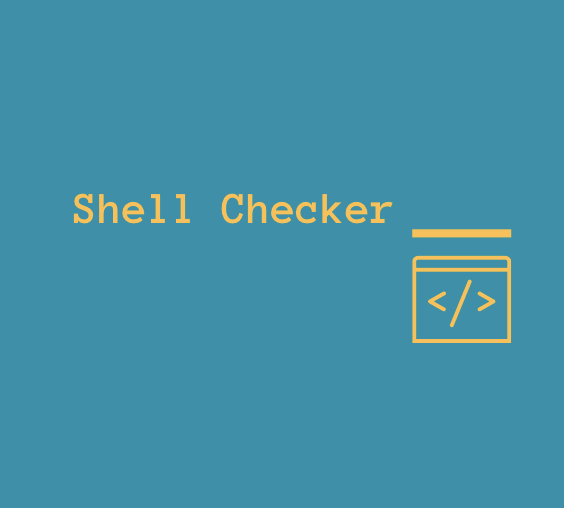

<p align="center">
  
</p>

<h1 align="center">
  PR Shell Checker
</h1>

Run [ShellCheck](https://www.shellcheck.net/) on shell files in your PR.

You can set the severity and types of warnings you want to exclude.

## Usage

Create a file `checker.yml` inside `.github/workflows`:

```yaml
on: [pull_request]

jobs:
  shell-check:
    runs-on: ubuntu-latest
    name: Shell Checker
    steps:
      - uses: actions/checkout@v2
      - uses: marounmaroun/shell-checker@v1
        with:
          GITHUB_TOKEN: ${{ secrets.GITHUB_TOKEN }}
          severity: 'info'
          exclude: ''
```

You can set the severity to one of: "error, warning, info, style". Default is "info".

You can also include type of warnings to exclude. For example:

```yaml
exclude: 'SC2006,SC2148'
```

Default value is not set, meaning that there will be no exclusions.